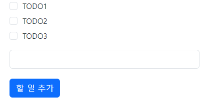

# TO DO LIST on Chrome




## Get Started


### 1. Clone

```
git clone https://github.com/JadeKim042386/chrome-extension-TODO.git
```

### 2. Load unpacked

- Select `chrome-extension-TODO` directory

## Usage

### Add To do

1. Fill in the input box
2. Click Button or Press Enter

### Complete

- Disappear when Checked
